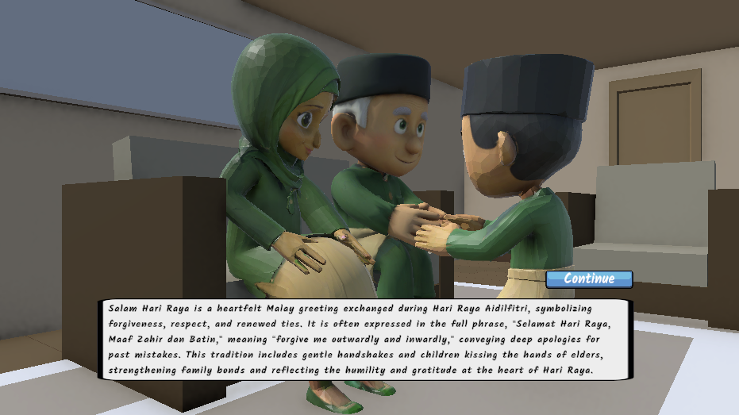

# How to Extract Images from Your PDF Report

Your PDF contains **13 figures (Rajah)** showing screenshots of the LEBARAN application. Here's how to extract them:

## Images in Your Report

1. **Rajah 1** - Main Menu Interface
2. **Rajah 2** - Player Name Input Screen
3. **Rajah 3** - 3D Village Model
4. **Rajah 4** - 3D Mosque Model
5. **Rajah 5** - Character in Malay Dress (Baju Melayu)
6. **Rajah 6** - Character in Kurung Dress
7. **Rajah 7** - Camera/Player Movement View
8. **Rajah 8** - Cultural Quiz Game Interface
9. **Rajah 9** - Malay Dress Matching Game
10. **Rajah 10** - Kurung Dress Matching Game
11. **Rajah 11** - 3D Traditional Food Model
12. **Rajah 12** - Greeting Custom Animation
13. **Rajah 13** - Achievement Rewards Module

---

## Method 1: macOS Preview (Easiest) ⭐

1. **Open the PDF:**
   - Right-click `A197448_TReport.pdf`
   - Select "Open With" → "Preview"

2. **Extract Images:**
   - Go to **Tools** menu (top menu bar)
   - Click **"Images"** 
   - Select the images you want to extract
   - Click **"Copy"**

3. **Save Images:**
   - Create folder: `Assets/Screenshots/`
   - Open Preview for each image you copied
   - File → **Export As**
   - Name: `01_main_menu.png`, `02_village.png`, etc.
   - Format: **PNG**
   - Location: `Assets/Screenshots/`

---

## Method 2: Free Online Tool 🌐

**Using ilovepdf.com:**

1. Go to [ilovepdf.com](https://ilovepdf.com)
2. Find "Extract Images" tool
3. Upload your `A197448_TReport.pdf`
4. Click "Extract Images"
5. Download all images as ZIP
6. Extract to `Assets/Screenshots/` folder
7. Rename files for clarity

**Alternative sites:**
- [pdf2image.com](https://pdf2image.com)
- [pdftoimage.com](https://pdftoimage.com)

---

## Method 3: Command Line (Advanced) 🖥️

**Using Python:**

```bash
# Install required library
pip install pdf2image pillow

# Create a Python script (extract_images.py):
```

```python
from pdf2image import convert_from_path

# Convert PDF to images
images = convert_from_path('A197448_TReport.pdf')

# Save each page as image
for i, image in enumerate(images):
    image.save(f'Assets/Screenshots/page_{i+1}.png', 'PNG')
```

```bash
# Run the script
python extract_images.py
```

---

## Step 2: Organize Your Images

Create this folder structure:

```
lebaran-fyp-unity-3d/
├── Assets/
│   └── Screenshots/
│       ├── 01_main_menu.png
│       ├── 02_player_input.png
│       ├── 03_village_model.png
│       ├── 04_mosque_model.png
│       ├── 05_character_melayu.png
│       ├── 06_character_kurung.png
│       ├── 07_camera_view.png
│       ├── 08_quiz_game.png
│       ├── 09_dress_matching_melayu.png
│       ├── 10_dress_matching_kurung.png
│       ├── 11_food_model.png
│       ├── 12_greeting_animation.png
│       └── 13_rewards_module.png
└── README.md
```

---

## Step 3: Add Images to README

Update the **Screenshots & Media** section in `README.md`:

```markdown
## 📸 Gallery

### Main Interface & Navigation


*LEBARAN Main Menu Screen*


*Player Name Input Screen*

### 3D Environment


*Traditional Malay Village - 3D Model*


*Traditional Mosque - Key Cultural Building*

### Characters & Costumes


*Male Character in Traditional Baju Melayu*


*Female Character in Traditional Baju Kurung*

### Interactive Modules


*Cultural Quiz - Test Knowledge of Hari Raya Traditions*


*Interactive Module: Match Traditional Baju Melayu Components*


*Achievement & Rewards Module - Gamification Elements*

### Cultural Objects


*3D Models of Traditional Hari Raya Food (Ketupat, Lemang)*


*Learn Traditional Greeting Customs (Bersalaman)*
```

---

## Quick Tip 💡

If the images are large, optimize them before committing:

```bash
# On Mac/Linux with ImageMagick (optional)
convert 01_main_menu.png -resize 1200x800 01_main_menu_optimized.png
```

---

## Troubleshooting

**Images are blurry after extraction?**
- Use Method 1 or 2 for better quality
- Avoid re-compressing images

**PDF won't open in Preview?**
- Try opening with Preview in Finder directly
- Alternative: Use Adobe Reader

**Online tool is slow?**
- Try Method 1 (Preview) - fastest on Mac
- Use a different online tool

**Command line method won't work?**
- Make sure Python is installed: `python --version`
- Try: `python3` instead of `python`

---

Done! Your README will now have visual examples of all the features! ✨
