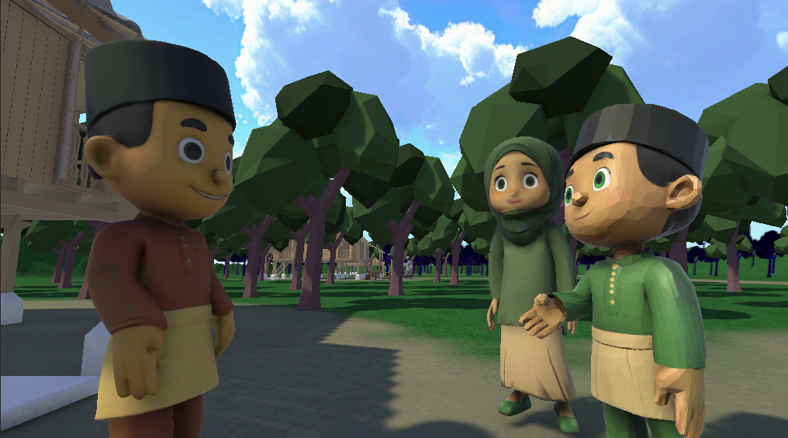

# LEBARAN - Game-Based Learning Application

<div align="center">


*A game-based learning application exploring traditional Hari Raya (Eid) celebrations in Malaysia through immersive 3D environments and interactive activities.*

**FYP Project** | Faculty of Technology & Information Sciences | Universiti Kebangsaan Malaysia

[Features](#features) • [Tech Stack](#tech-stack) • [Getting Started](#getting-started) • [Testing Results](#testing-results) • [Gallery](#gallery)

</div>

---

## 📋 About

**LEBARAN** is a **Final Year Project** that develops an interactive digital learning application for exploring traditional Hari Raya Aidilfitri customs and traditions in Malaysia. The project combines **Game-Based Learning (GBL)** principles with 3D game development to create an engaging educational experience about Malaysian cultural heritage.

**Problem Addressed:**
- Lack of exposure to Malay customs and traditions among younger generations
- Limited interactive learning mediums for cultural heritage education
- Need for modern, engaging approaches to preserve cultural traditions

**Institution:** Universiti Kebangsaan Malaysia (UKM)  
**Supervisor:** Dr. Fadhilah binti Rosdi  
**Full Technical Report:** [View on UKM Repository](https://ftsm.ukm.my/v6/public/assets/file/technicalreport/A197448_TReport.pdf)

---

## ✨ Features

- 🏘️ **Virtual Village Exploration** - Freely explore a 3D traditional Malay village in Hari Raya atmosphere
- 🎮 **Cultural Quiz Module** - Test knowledge on Hari Raya traditions, customs, and practices
- 👗 **Traditional Dress Matching** - Interactive games matching Baju Melayu and Baju Kurung components
- 🏠 **Cultural Object Interaction** - Discover traditional items (ketupat, lemang, pelita) with detailed information
- 🎯 **Reward System** - Unlock achievements and digital rewards for completing activities
- 🕌 **Authentic Architecture** - 3D modeled traditional Malay mosque and kampung structures
- 🎨 **Cultural Aesthetics** - UI design incorporating bunga raya, songket, and batik patterns
- 🔊 **Immersive Audio** - Ambient sounds (roosters, wind, children's voices) for authentic atmosphere

---

## 🛠️ Tech Stack

**Engine & Framework:**
- Unity 3D (2022.3+)
- C# 11

**Key Technologies:**
- Universal Render Pipeline (URP)
- Addressable Asset System
- Input System (New)
- Timeline/Animation System
- TextMesh Pro

**Tools & External Assets:**
- Visual Studio Code / JetBrains Rider
- [Asset Store packages used]
- [Any 3D modeling tools - Blender, Maya, etc.]

**Version Control:**
- Git & GitHub

---

## 🚀 Getting Started

### Prerequisites

- **Unity 2022.3** or higher ([Download](https://unity.com/download))
- **Git** for version control
- **System Requirements:**
  - Windows 10+ / macOS 10.13+ / Linux
  - 4GB RAM minimum
  - GPU with OpenGL 4.1+ support

### Installation

1. **Clone the repository:**
   ```bash
   git clone https://github.com/yourusername/lebaran-fyp-unity-3d.git
   cd lebaran-fyp-unity-3d
   ```

2. **Open in Unity:**
   - Launch Unity Hub
   - Click "Add" → Select the cloned folder
   - Open the project with Unity 2022.3+

3. **Install Dependencies:**
   ```bash
   # If using any external packages via NuGet or similar
   dotnet restore
   ```

4. **Play the Scene:**
   - Open `Assets/Scenes/MainScene.unity`
   - Press Play (Ctrl/Cmd + P) in the Unity Editor

### Building for Different Platforms

**Windows:**
```bash
File → Build Settings → Select PC, Mac & Linux Standalone → Build
```

**WebGL:**
```bash
File → Build Settings → Select WebGL → Build
```

**Mobile (Android/iOS):**
```bash
File → Build Settings → Select Android/iOS → Build
```

---

## 📁 Project Structure

```
Assets/
├── Scenes/              # Game scenes
│   ├── MainScene.unity
│   ├── MainMenu.unity
│   └── Credits.unity
├── Scripts/             # C# scripts
│   ├── Core/           # Core gameplay logic
│   ├── UI/             # UI controllers
│   ├── Camera/         # Camera systems
│   └── Managers/       # Game managers
├── Models/             # 3D models & meshes
├── Textures/           # Texture assets
├── Materials/          # Material definitions
├── Prefabs/            # Reusable game objects
├── Audio/              # Music & sound effects
│   ├── Music/
│   └── SFX/
├── UI/                 # UI panels & layouts
└── Resources/          # Runtime loadable assets
```

---

## 🎮 Gameplay Modules

### 1. Kampung Exploration (Village Exploration)
- **Objective:** Freely explore a 3D traditional Malay village during Hari Raya morning
- **Interactions:** Approach objects to learn about cultural items (ketupat, lemang, pelita)
- **Controls:** WASD to move, Mouse to look around
- **Learning:** Discover traditional customs through environmental storytelling

### 2. Kuiz Budaya (Cultural Quiz)
- **Objective:** Answer questions about Hari Raya traditions
- **Question Topics:** Food, customs, clothing, greetings
- **Mechanics:** Multiple-choice answers with instant feedback
- **Rewards:** Unlock achievements for correct answers

### 3. Padanan Pakaian (Dress Matching)
- **Objective:** Match traditional clothing components (Baju Melayu / Baju Kurung)
- **Mechanics:** Drag-and-drop clothing pieces to appropriate positions
- **Educational Value:** Learn traditional dress structure and components
- **Rewards:** Complete outfits unlock achievement badges

### 4. Interaksi Adat (Cultural Customs)
- **Objective:** Observe and learn about greeting customs
- **Mechanics:** Watch animated characters performing traditional greetings (bersalaman)
- **Information:** Contextual text explains cultural significance

### Controls

| Input | Action |
|-------|--------|
| W/A/S/D | Move character |
| Mouse Movement | Look around |
| E / Click | Interact with objects |
| UI Buttons | Navigate menus |

---

## 📊 Testing Results

**User Testing conducted with 30 respondents**

### Usability & Understanding
- **63.3%** found the app easy to use without written guidance
- **60%** confirmed content is clear and readable
- **56.7%** stated overall app is easy to understand from start to finish

### User Satisfaction
- **96.7%** expressed satisfaction with the application
- **100%** confirmed app functions as intended
- **100%** agreed gamification helps with cultural learning
- **93.3%** experienced no technical issues during testing

### Learning Effectiveness
- **60%** strongly agreed the app helps in learning
- **56.7%** found it helpful for improving learning performance
- **96.7%** interested in using gamified apps for other cultural topics

### Areas for Improvement (User Feedback)
- Additional cultural modules (house decoration, traditional recipes)
- Expanded quiz questions
- Enhanced NPC interactions
- VR/AR support for future versions
- Traditional audio (Malay music)

### Screenshots & Media

*Images from the PDF report can be added here. See [Adding Screenshots](#adding-screenshots) section below.*

---

## 🛠️ Development Details

### Methodology
- **Approach:** Agile Development with iterative cycles
- **Phases:** Planning → Requirements Analysis → Design → Development → Testing

### Tools & Software Used
- **Game Engine:** Unity 3D (2022.3+)
- **3D Modeling:** Blender (models for buildings, characters, objects)
- **Programming:** C# with Visual Studio
- **Version Control:** Git

### Key Implementation Areas
- **3D Environment Design:** Traditional Malay village layout
- **Character Models:** Traditional dressed characters (Baju Melayu, Baju Kurung)
- **Interactive Systems:** Object proximity detection, quiz mechanics, drag-and-drop
- **UI/UX:** Cultural-themed interface with Malay visual elements

---

## 🎯 Project Objectives & Outcomes

### Objectives Met
✅ Developed a functional game-based learning application for cultural education  
✅ Created immersive 3D environment representing traditional Malay village  
✅ Implemented multiple interactive learning modules (quiz, dress matching, object interaction)  
✅ Conducted user testing with 30 participants  
✅ Received positive feedback on usability and cultural learning value  

### Limitations & Challenges
- Time and resource constraints limited full feature implementation
- Access to authentic cultural reference materials
- 3D animation development is resource-intensive
- Some proposed features (VR, multiplayer) deferred to future versions

### Future Enhancements
- Additional cultural modules (home decoration, cooking, games)
- Augmented Reality (AR) features for real-world interaction
- Expanded quiz database with difficulty levels
- Multiplayer leaderboard system
- Integration of traditional Malay music and audio
- Mobile app version

---

## 📝 Citation

If you reference this project in academic work:

```
Shaifull Naim, M. Z., & Rosdi, F. (2025). LEBARAN: Aplikasi Pembelajaran Berasaskan 
Permainan Bagi Penerokaan Tradisi Aidilfitri. Final Year Project, Faculty of Technology 
& Information Sciences, Universiti Kebangsaan Malaysia.
```

---

## 📝 License

This project is licensed under the MIT License - see the [LICENSE](LICENSE) file for details.

---

## 👤 Author

**Muhammad Zafri bin Shaifull Naim**
- 📧 Email: muhdzafri2015@gmail.com
- 🐙 GitHub: [@muhdzafri](https://github.com/muhdzafri)
- 📚 **Project Type:** Final Year Project (FYP)
- 🏫 **Institution:** Universiti Kebangsaan Malaysia
- 👨‍🎓 **Supervisor:** Dr. Fadhilah binti Rosdi

---

## 📚 References & Resources

### Full Technical Report
📄 **[Complete FYP Technical Report (PDF)](https://ftsm.ukm.my/v6/public/assets/file/technicalreport/A197448_TReport.pdf)** - Full project documentation including methodology, implementation details, testing results, and conclusions (A197448_TReport.pdf)

### Academic References
- Adipat, S., et al. (2021). Game-based learning in preserving cultural heritage. *International Journal of Emerging Technologies in Learning*, 16(9), 64-76.
- Cheng, M.-T. & Su, C.-H. (2012). A game-based learning approach to improve students' learning achievements. *Turkish Online Journal of Educational Technology*, 11(2), 1-10.
- Mortara, M., et al. (2014). Learning cultural heritage by serious games. *Journal of Cultural Heritage*, 15(3), 318-325.

### Development Resources
- [Unity Official Documentation](https://docs.unity.com/)
- [C# Coding Conventions](https://learn.microsoft.com/en-us/dotnet/csharp/fundamentals/coding-style/coding-conventions)
- [Blender 3D Modeling](https://www.blender.org/)
- [Game-Based Learning Principles](https://learn.unity.com/)

---

## 🙏 Acknowledgments

- **Supervisor:** Dr. Fadhilah binti Rosdi for guidance and feedback
- **Institution:** Universiti Kebangsaan Malaysia (UKM) Faculty of Technology & Information Sciences
- **Testing Participants:** 30 volunteers who participated in usability testing
- **References:** Literature on Game-Based Learning, cultural heritage preservation, and digital storytelling
- **Assets:** 3D models created using Blender; UI elements designed with cultural authenticity in mind

---

## 🖼️ Adding Screenshots

To add images from your PDF report to this README:

### Step 1: Extract Images from PDF
**Option A - Using macOS Preview (Easiest):**
1. Open `A197448_TReport.pdf` in Preview
2. Use Tools → Images to select images
3. Save them to `Assets/Screenshots/` folder

**Option B - Using Online Tools:**
- Go to [ilovepdf.com](https://ilovepdf.com) or similar PDF tools
- Upload your PDF
- Download extracted images

**Option C - Using Python (if you have it):**
```bash
pip install pdf2image
# Then use scripts to extract pages as images
```

### Step 2: Organize Screenshots
Create folder structure:
```
Assets/
├── Screenshots/
│   ├── 01_main_menu.png
│   ├── 02_village_exploration.png
│   ├── 03_quiz_game.png
│   ├── 04_dress_matching.png
│   └── 05_rewards.png
```

### Step 3: Add to README
Replace the screenshot section with:
```markdown
### Main Menu


### Village Exploration


### Cultural Quiz Game


### Traditional Dress Matching


### Achievement Rewards

```

---

<div align="center">

Made with ❤️ for cultural preservation

[⬆ Back to Top](#lebaran---game-based-learning-application)

</div>
